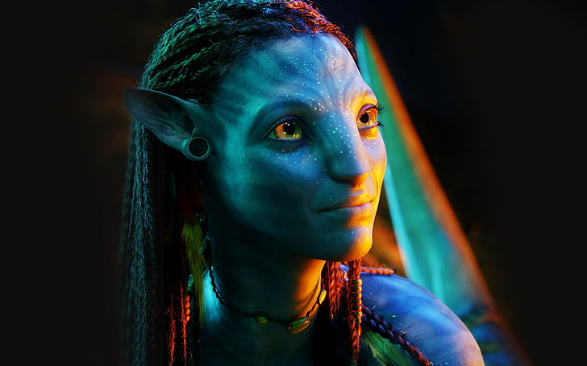

# Image Scaling with Linear Interpolation from scratch

This Python script demonstrates image scaling using linear interpolation. It takes an original image, converts it to grayscale, resamples it to a reduced size, and upscales it back to its original dimensions. Mean Squared Error (MSE) is used to quantify the difference between the original and upscaled images.

## Usage

1. Place your original image in the same directory as the script.
2. Modify the `filename` variable in the script to match the name of your original image.
3. Run the script.

## Results

### Image Comparison

| Original Image | Resampled Image | Upscaled Image |
| -------------- | --------------- | -------------- |
|  |  |  |

### Mean Squared Error (MSE)

The MSE between the original and upscaled images is calculated and displayed in the script.

## Dependencies

- Python 3.x
- NumPy
- PIL (Python Imaging Library)
- Matplotlib

## Acknowledgments

- This project is a demonstration of image scaling techniques.
- Thanks to the Python community for their open-source libraries.

